%  Introduction to MATLAB
% ----------------------------------------------------------------
% topic
% 1- Data Types and Variables.
% 2- Operators.
% 3- Comparison Operators.
% 4- flow control.
% 5- functions.
% 6- input/output.
% 7- Array Manipulation.
% 8- Writing and Running Programs.
% 9- plotting.

## 1- Data Types and Variables. ##

 Data Types
  x = 1 + 3i % Complex number
 >> class(x)
 ans =
 double

 Variables

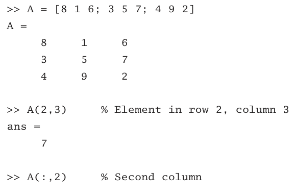

 >> warning off % Suppresses print of warning messages
 >> 5/0
 ans =
 Inf
 >> 5*NaN
 ans =
 NaN
 % Most operations with NaN result in NaN
 >> NaN == NaN % Different NaN’s are not equal!
 ans =
 0
 >> eps
 ans =
 2.2204e-016

 array
  >> b = [1 2 3]
 b =
 % Row vector
 1 2 3
 >> b = [1; 2; 3]
 b =
 1
 2
 3
  >> b = [1 2 3]’
 b =
 1
 2
 3
 

 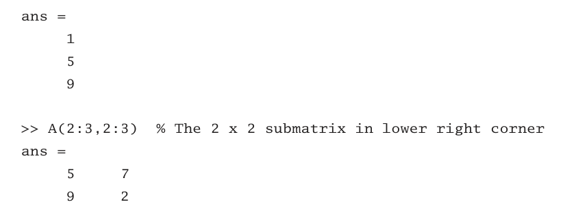

 cells 

 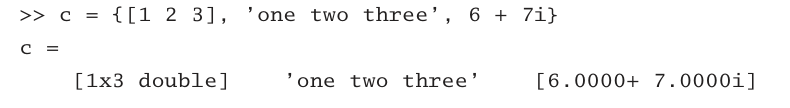

## 2- Operators. ##

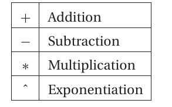

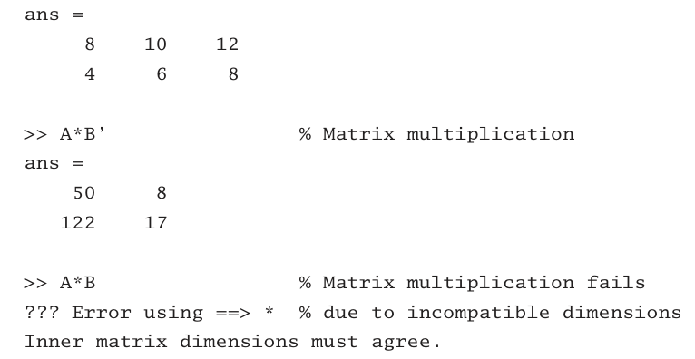

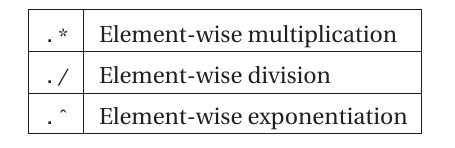

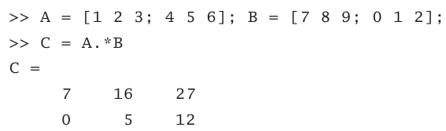

## 3- Comparison Operators. ##

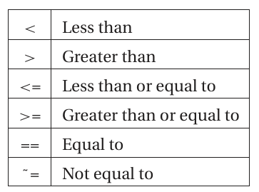

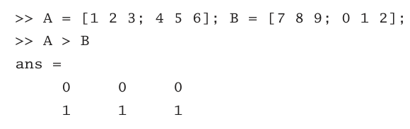

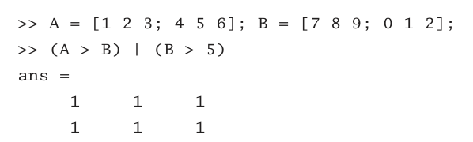

## 4- flow control. ##
if, else, elseif
   
    if condition 
          block
    end
    if condition
        block
    elseif condition
    block
    .
    .
    end

    .
    .
        else
             block
        end
switch 

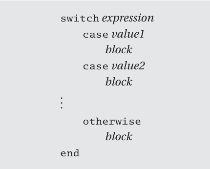
